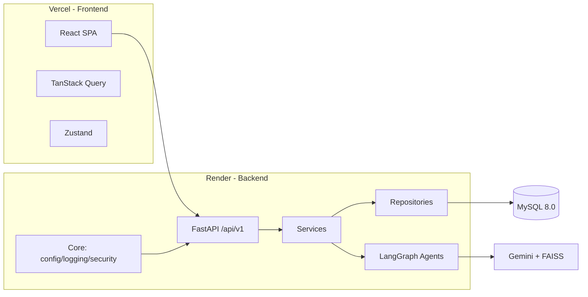
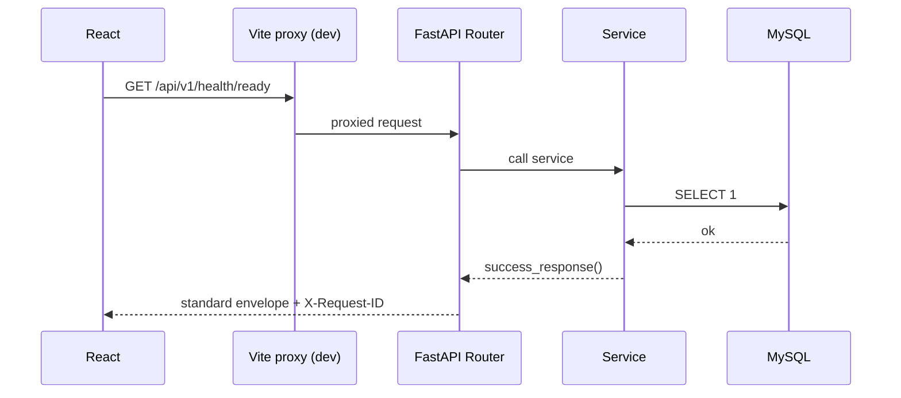

# Architecture diagrams

Mermaid / excalidraw source for the diagrams referenced in `docs/architecture.md`.

## High-level

```mermaid
flowchart LR
    subgraph Vercel[Vercel - Frontend]
        React[React SPA]
        TQ[TanStack Query]
        Z[Zustand]
    end
    subgraph Render[Render - Backend]
        API[FastAPI /api/v1]
        SVC[Services]
        REPO[Repositories]
        AGENTS[LangGraph Agents]
        CORE[Core: config/logging/security]
    end
    DB[(MySQL 8.0)]
    AI[Gemini + FAISS]

    React --> API
    API --> SVC --> REPO --> DB
    SVC --> AGENTS --> AI
    CORE --> API
```

## Request lifecycle

```mermaid
sequenceDiagram
    participant R as React
    participant V as Vite proxy (dev)
    participant A as FastAPI Router
    participant S as Service
    participant DB as MySQL

    R->>V: GET /api/v1/health/ready
    V->>A: proxied request
    A->>S: call service
    S->>DB: SELECT 1
    DB-->>S: ok
    S-->>A: success_response()
    A-->>R: standard envelope + X-Request-ID
```
